# User Flow Documentation

This document provides comprehensive user flow diagrams and descriptions for AureusERP, covering the complete journey from user login through core business processes from a user's perspective.

## Table of Contents

1. [System Overview](#system-overview)
2. [User Authentication & Setup](#user-authentication--setup)
3. [Sales Process (Quote-to-Cash)](#sales-process-quote-to-cash)
4. [Purchase Process (Procure-to-Pay)](#purchase-process-procure-to-pay)
5. [Inventory Management](#inventory-management)
6. [Financial Management](#financial-management)
7. [HR & Employee Management](#hr--employee-management)
8. [Project Management](#project-management)
9. [Reporting & Analytics](#reporting--analytics)

## System Overview

AureusERP is a comprehensive business management system that provides different interfaces based on user roles and responsibilities.

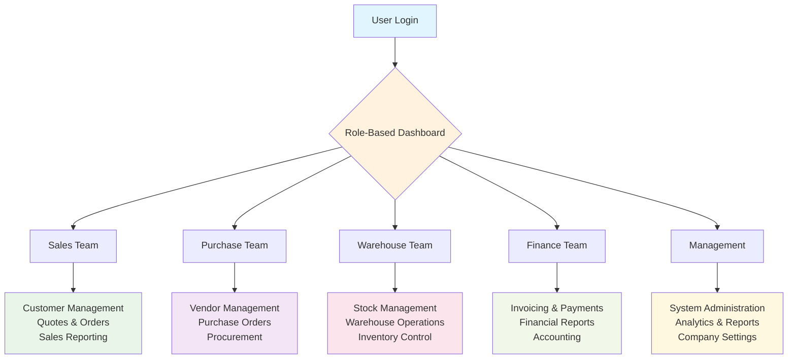
```mermaid
graph TD
    A[User Login] --> B{Role-Based Dashboard}
    B --> C[Sales Team]
    B --> D[Purchase Team]
    B --> E[Warehouse Team]
    B --> F[Finance Team]
    B --> G[Management]
    
    C --> H[Customer Management<br/>Quotes & Orders<br/>Sales Reporting]
    D --> I[Vendor Management<br/>Purchase Orders<br/>Procurement]
    E --> J[Stock Management<br/>Warehouse Operations<br/>Inventory Control]
    F --> K[Invoicing & Payments<br/>Financial Reports<br/>Accounting]
    G --> L[System Administration<br/>Analytics & Reports<br/>Company Settings]
    
    style A fill:#e1f5fe
    style B fill:#fff3e0
    style H fill:#e8f5e8
    style I fill:#f3e5f5
    style J fill:#fce4ec
    style K fill:#f1f8e9
    style L fill:#fff8e1
```

## User Authentication & Setup

### Initial System Access Flow

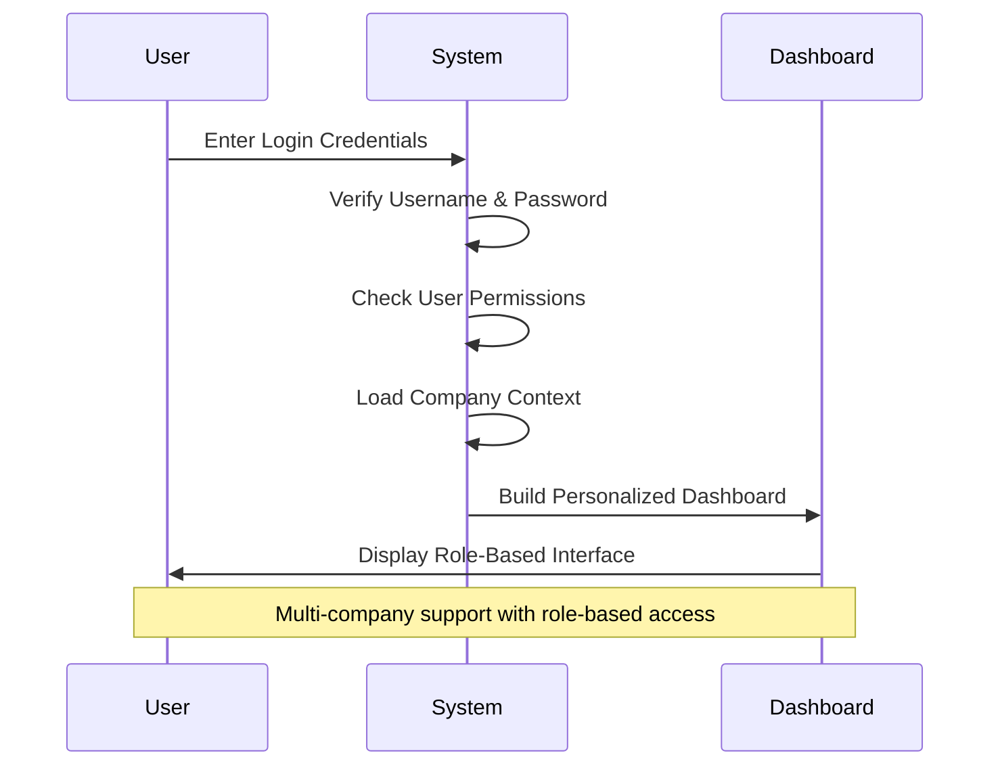
```mermaid
sequenceDiagram
    participant U as User
    participant S as System
    participant D as Dashboard
    
    U->>S: Enter Login Credentials
    S->>S: Verify Username & Password
    S->>S: Check User Permissions
    S->>S: Load Company Context
    S->>D: Build Personalized Dashboard
    D->>U: Display Role-Based Interface
    
    Note over U,D: Multi-company support with role-based access
```

### User Onboarding Process

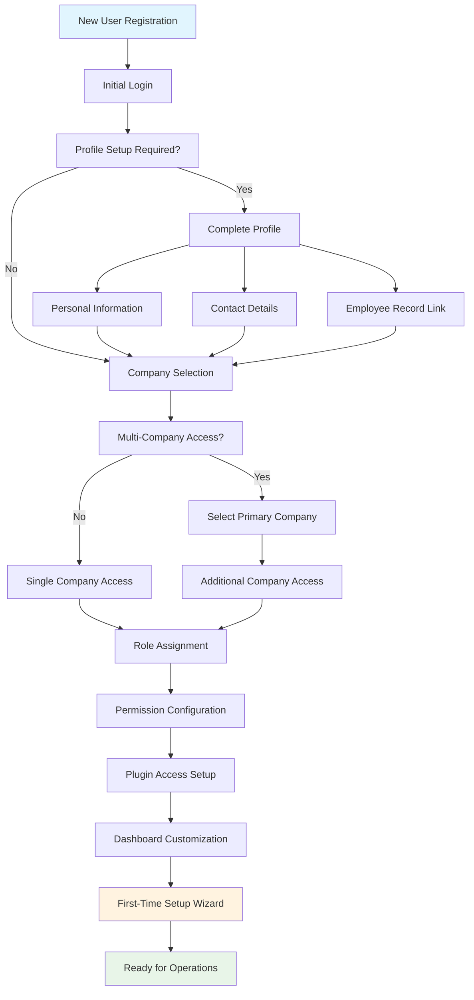
```mermaid
flowchart TD
    A[New User Registration] --> B[Initial Login]
    B --> C[Profile Setup Required?]
    C -->|Yes| D[Complete Profile]
    C -->|No| E[Company Selection]
    
    D --> D1[Personal Information]
    D --> D2[Contact Details]
    D --> D3[Employee Record Link]
    D1 --> E
    D2 --> E
    D3 --> E
    
    E --> F[Multi-Company Access?]
    F -->|Yes| G[Select Primary Company]
    F -->|No| H[Single Company Access]
    
    G --> I[Additional Company Access]
    H --> J[Role Assignment]
    I --> J
    
    J --> K[Permission Configuration]
    K --> L[Plugin Access Setup]
    L --> M[Dashboard Customization]
    M --> N[First-Time Setup Wizard]
    N --> O[Ready for Operations]
    
    style A fill:#e1f5fe
    style O fill:#e8f5e8
    style N fill:#fff3e0
```

### Role-Based Access Control

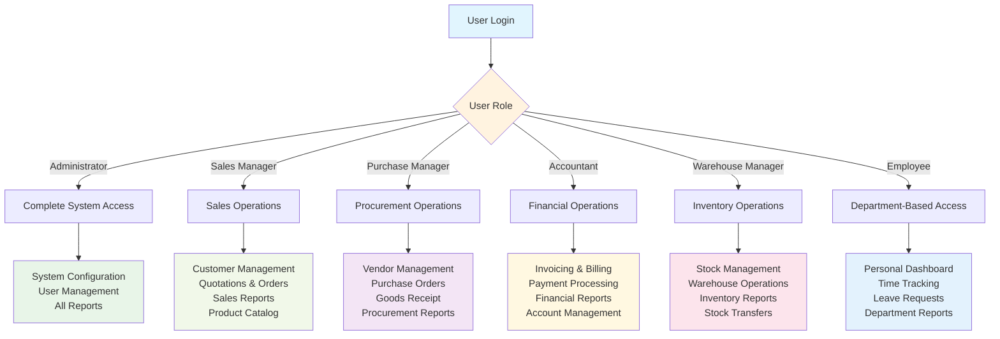
```mermaid
graph TD
    A[User Login] --> B{User Role}
    
    B -->|Administrator| C[Complete System Access]
    B -->|Sales Manager| D[Sales Operations]
    B -->|Purchase Manager| E[Procurement Operations]
    B -->|Accountant| F[Financial Operations]
    B -->|Warehouse Manager| G[Inventory Operations]
    B -->|Employee| H[Department-Based Access]
    
    C --> C1[System Configuration<br/>User Management<br/>All Reports]
    
    D --> D1[Customer Management<br/>Quotations & Orders<br/>Sales Reports<br/>Product Catalog]
    
    E --> E1[Vendor Management<br/>Purchase Orders<br/>Goods Receipt<br/>Procurement Reports]
    
    F --> F1[Invoicing & Billing<br/>Payment Processing<br/>Financial Reports<br/>Account Management]
    
    G --> G1[Stock Management<br/>Warehouse Operations<br/>Inventory Reports<br/>Stock Transfers]
    
    H --> H1[Personal Dashboard<br/>Time Tracking<br/>Leave Requests<br/>Department Reports]
    
    style A fill:#e1f5fe
    style B fill:#fff3e0
    style C1 fill:#e8f5e8
    style D1 fill:#f1f8e9
    style E1 fill:#f3e5f5
    style F1 fill:#fff8e1
    style G1 fill:#fce4ec
    style H1 fill:#e3f2fd
```

## Sales Process (Quote-to-Cash)

### Complete Sales Workflow

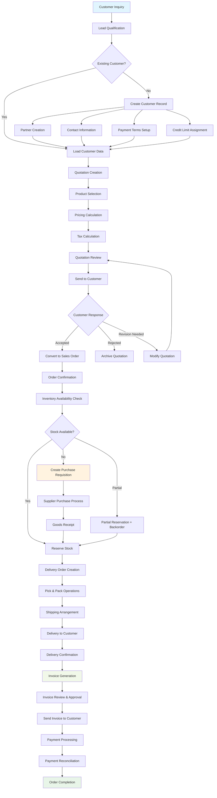
```mermaid
flowchart TD
    A[Customer Inquiry] --> B[Lead Qualification]
    B --> C{Existing Customer?}
    C -->|No| D[Create Customer Record]
    C -->|Yes| E[Load Customer Data]
    
    D --> D1[Partner Creation]
    D --> D2[Contact Information]
    D --> D3[Payment Terms Setup]
    D --> D4[Credit Limit Assignment]
    D1 --> E
    D2 --> E
    D3 --> E
    D4 --> E
    
    E --> F[Quotation Creation]
    F --> G[Product Selection]
    G --> H[Pricing Calculation]
    H --> I[Tax Calculation]
    I --> J[Quotation Review]
    J --> K[Send to Customer]
    
    K --> L{Customer Response}
    L -->|Accepted| M[Convert to Sales Order]
    L -->|Rejected| N[Archive Quotation]
    L -->|Revision Needed| O[Modify Quotation]
    O --> J
    
    M --> P[Order Confirmation]
    P --> Q[Inventory Availability Check]
    Q --> R{Stock Available?}
    R -->|Yes| S[Reserve Stock]
    R -->|Partial| T[Partial Reservation + Backorder]
    R -->|No| U[Create Purchase Requisition]
    
    U --> V[Supplier Purchase Process]
    V --> W[Goods Receipt]
    W --> S
    T --> S
    
    S --> X[Delivery Order Creation]
    X --> Y[Pick & Pack Operations]
    Y --> Z[Shipping Arrangement]
    Z --> AA[Delivery to Customer]
    AA --> BB[Delivery Confirmation]
    
    BB --> CC[Invoice Generation]
    CC --> DD[Invoice Review & Approval]
    DD --> EE[Send Invoice to Customer]
    EE --> FF[Payment Processing]
    FF --> GG[Payment Reconciliation]
    GG --> HH[Order Completion]
    
    style A fill:#e1f5fe
    style HH fill:#e8f5e8
    style U fill:#fff3e0
    style CC fill:#f1f8e9
```

### Detailed Sales Order Processing

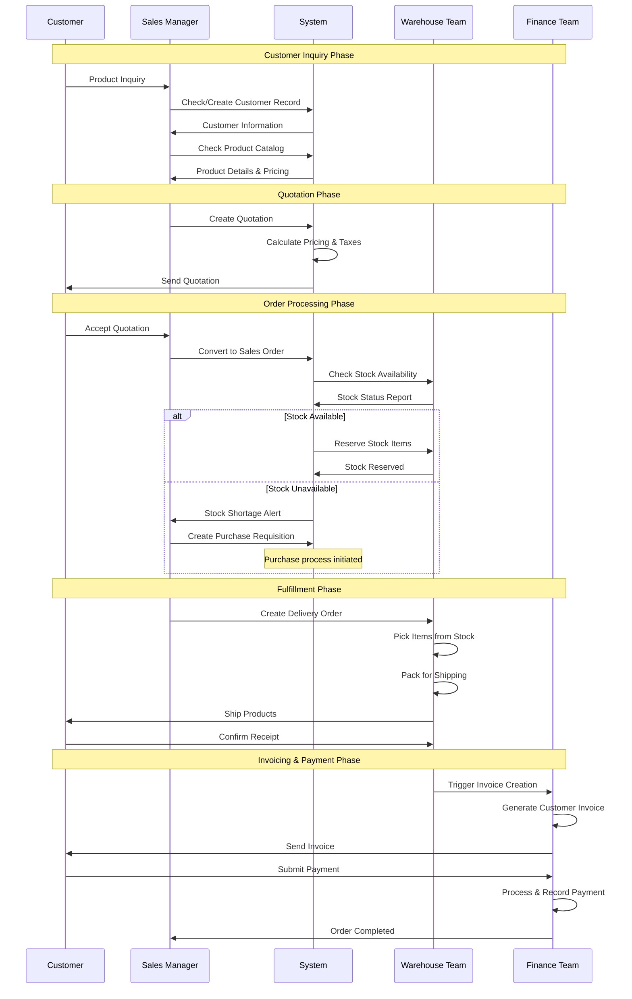
```mermaid
sequenceDiagram
    participant C as Customer
    participant SM as Sales Manager
    participant SYS as System
    participant WH as Warehouse Team
    participant FIN as Finance Team
    
    Note over C,FIN: Customer Inquiry Phase
    C->>SM: Product Inquiry
    SM->>SYS: Check/Create Customer Record
    SYS->>SM: Customer Information
    SM->>SYS: Check Product Catalog
    SYS->>SM: Product Details & Pricing
    
    Note over C,FIN: Quotation Phase
    SM->>SYS: Create Quotation
    SYS->>SYS: Calculate Pricing & Taxes
    SYS->>C: Send Quotation
    
    Note over C,FIN: Order Processing Phase
    C->>SM: Accept Quotation
    SM->>SYS: Convert to Sales Order
    SYS->>WH: Check Stock Availability
    WH->>SYS: Stock Status Report
    
    alt Stock Available
        SYS->>WH: Reserve Stock Items
        WH->>SYS: Stock Reserved
    else Stock Unavailable
        SYS->>SM: Stock Shortage Alert
        SM->>SYS: Create Purchase Requisition
        Note over SYS: Purchase process initiated
    end
    
    Note over C,FIN: Fulfillment Phase
    SM->>WH: Create Delivery Order
    WH->>WH: Pick Items from Stock
    WH->>WH: Pack for Shipping
    WH->>C: Ship Products
    C->>WH: Confirm Receipt
    
    Note over C,FIN: Invoicing & Payment Phase
    WH->>FIN: Trigger Invoice Creation
    FIN->>FIN: Generate Customer Invoice
    FIN->>C: Send Invoice
    C->>FIN: Submit Payment
    FIN->>FIN: Process & Record Payment
    FIN->>SM: Order Completed
```

### Sales Pipeline Management

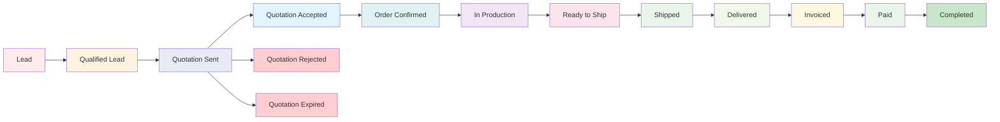
```mermaid
graph LR
    A[Lead] --> B[Qualified Lead]
    B --> C[Quotation Sent]
    C --> D[Quotation Accepted]
    D --> E[Order Confirmed]
    E --> F[In Production]
    F --> G[Ready to Ship]
    G --> H[Shipped]
    H --> I[Delivered]
    I --> J[Invoiced]
    J --> K[Paid]
    K --> L[Completed]
    
    C --> M[Quotation Rejected]
    C --> N[Quotation Expired]
    
    style A fill:#ffebee
    style B fill:#fff3e0
    style C fill:#e8eaf6
    style D fill:#e1f5fe
    style E fill:#e0f2f1
    style F fill:#f3e5f5
    style G fill:#fce4ec
    style H fill:#e8f5e8
    style I fill:#f1f8e9
    style J fill:#fff8e1
    style K fill:#e8f5e8
    style L fill:#c8e6c9
    style M fill:#ffcdd2
    style N fill:#ffcdd2
```

### Customer Relationship Management

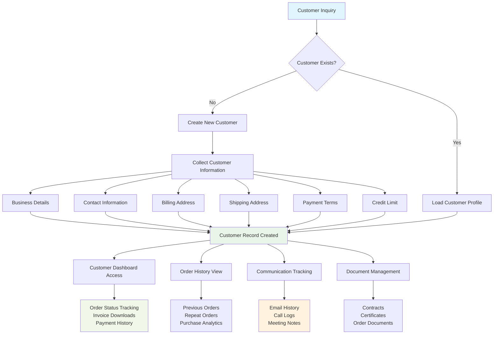
```mermaid
flowchart TD
    A[Customer Inquiry] --> B{Customer Exists?}
    B -->|No| C[Create New Customer]
    B -->|Yes| D[Load Customer Profile]
    
    C --> E[Collect Customer Information]
    E --> F[Business Details]
    E --> G[Contact Information]
    E --> H[Billing Address]
    E --> I[Shipping Address]
    E --> J[Payment Terms]
    E --> K[Credit Limit]
    
    F --> L[Customer Record Created]
    G --> L
    H --> L
    I --> L
    J --> L
    K --> L
    D --> L
    
    L --> M[Customer Dashboard Access]
    L --> N[Order History View]
    L --> O[Communication Tracking]
    L --> P[Document Management]
    
    M --> Q[Order Status Tracking<br/>Invoice Downloads<br/>Payment History]
    N --> R[Previous Orders<br/>Repeat Orders<br/>Purchase Analytics]
    O --> S[Email History<br/>Call Logs<br/>Meeting Notes]
    P --> T[Contracts<br/>Certificates<br/>Order Documents]
    
    style A fill:#e1f5fe
    style L fill:#e8f5e8
    style Q fill:#f1f8e9
    style S fill:#fff3e0
```

## Purchase Process (Procure-to-Pay)

### Complete Purchase Workflow

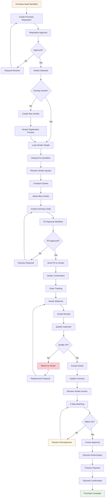
```mermaid
flowchart TD
    A[Purchase Need Identified] --> B[Create Purchase Requisition]
    B --> C[Requisition Approval]
    C --> D{Approved?}
    D -->|No| E[Request Revision]
    D -->|Yes| F[Vendor Selection]
    E --> B
    
    F --> G{Existing Vendor?}
    G -->|No| H[Create New Vendor]
    G -->|Yes| I[Load Vendor Details]
    H --> J[Vendor Registration Process]
    J --> I
    
    I --> K[Request for Quotation]
    K --> L[Receive Vendor Quotes]
    L --> M[Compare Quotes]
    M --> N[Select Best Vendor]
    N --> O[Create Purchase Order]
    
    O --> P[PO Approval Workflow]
    P --> Q{PO Approved?}
    Q -->|No| R[Revision Required]
    Q -->|Yes| S[Send PO to Vendor]
    R --> O
    
    S --> T[Vendor Confirmation]
    T --> U[Order Tracking]
    U --> V[Goods Shipment]
    V --> W[Goods Receipt]
    W --> X[Quality Inspection]
    
    X --> Y{Quality OK?}
    Y -->|No| Z[Return to Vendor]
    Y -->|Yes| AA[Accept Goods]
    Z --> BB[Replacement Request]
    BB --> V
    
    AA --> CC[Update Inventory]
    CC --> DD[Receive Vendor Invoice]
    DD --> EE[3-Way Matching]
    EE --> FF{Match OK?}
    FF -->|No| GG[Resolve Discrepancies]
    FF -->|Yes| HH[Invoice Approval]
    GG --> EE
    
    HH --> II[Payment Authorization]
    II --> JJ[Process Payment]
    JJ --> KK[Payment Confirmation]
    KK --> LL[Purchase Complete]
    
    style A fill:#fff3e0
    style LL fill:#e8f5e8
    style Z fill:#ffcdd2
    style GG fill:#fff8e1
```

### Purchase Order Processing Detail

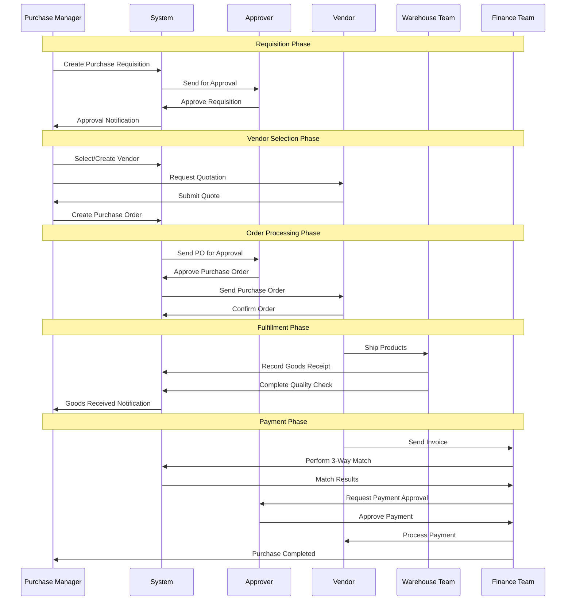
```mermaid
sequenceDiagram
    participant PM as Purchase Manager
    participant SYS as System
    participant APP as Approver
    participant V as Vendor
    participant WH as Warehouse Team
    participant FIN as Finance Team
    
    Note over PM,FIN: Requisition Phase
    PM->>SYS: Create Purchase Requisition
    SYS->>APP: Send for Approval
    APP->>SYS: Approve Requisition
    SYS->>PM: Approval Notification
    
    Note over PM,FIN: Vendor Selection Phase
    PM->>SYS: Select/Create Vendor
    PM->>V: Request Quotation
    V->>PM: Submit Quote
    PM->>SYS: Create Purchase Order
    
    Note over PM,FIN: Order Processing Phase
    SYS->>APP: Send PO for Approval
    APP->>SYS: Approve Purchase Order
    SYS->>V: Send Purchase Order
    V->>SYS: Confirm Order
    
    Note over PM,FIN: Fulfillment Phase
    V->>WH: Ship Products
    WH->>SYS: Record Goods Receipt
    WH->>SYS: Complete Quality Check
    SYS->>PM: Goods Received Notification
    
    Note over PM,FIN: Payment Phase
    V->>FIN: Send Invoice
    FIN->>SYS: Perform 3-Way Match
    SYS->>FIN: Match Results
    FIN->>APP: Request Payment Approval
    APP->>FIN: Approve Payment
    FIN->>V: Process Payment
    FIN->>PM: Purchase Completed
```

### Vendor Management Process

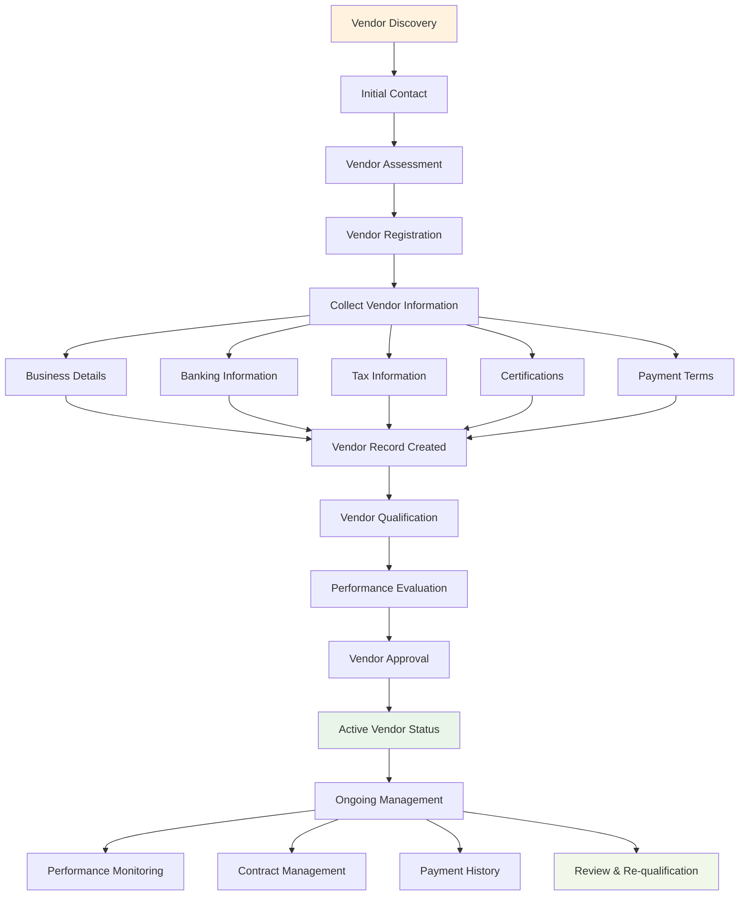
```mermaid
flowchart TD
    A[Vendor Discovery] --> B[Initial Contact]
    B --> C[Vendor Assessment]
    C --> D[Vendor Registration]
    
    D --> E[Collect Vendor Information]
    E --> F[Business Details]
    E --> G[Banking Information]
    E --> H[Tax Information]
    E --> I[Certifications]
    E --> J[Payment Terms]
    
    F --> K[Vendor Record Created]
    G --> K
    H --> K
    I --> K
    J --> K
    
    K --> L[Vendor Qualification]
    L --> M[Performance Evaluation]
    M --> N[Vendor Approval]
    N --> O[Active Vendor Status]
    
    O --> P[Ongoing Management]
    P --> Q[Performance Monitoring]
    P --> R[Contract Management]
    P --> S[Payment History]
    P --> T[Review & Re-qualification]
    
    style A fill:#fff3e0
    style O fill:#e8f5e8
    style T fill:#f1f8e9
```

## Inventory Management

### Complete Inventory Workflow

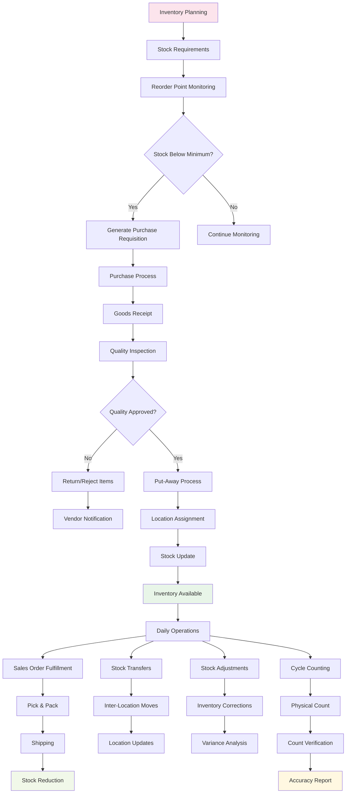
```mermaid
flowchart TD
    A[Inventory Planning] --> B[Stock Requirements]
    B --> C[Reorder Point Monitoring]
    C --> D{Stock Below Minimum?}
    D -->|Yes| E[Generate Purchase Requisition]
    D -->|No| F[Continue Monitoring]
    E --> G[Purchase Process]
    
    G --> H[Goods Receipt]
    H --> I[Quality Inspection]
    I --> J{Quality Approved?}
    J -->|No| K[Return/Reject Items]
    J -->|Yes| L[Put-Away Process]
    K --> M[Vendor Notification]
    
    L --> N[Location Assignment]
    N --> O[Stock Update]
    O --> P[Inventory Available]
    
    P --> Q[Daily Operations]
    Q --> R[Sales Order Fulfillment]
    Q --> S[Stock Transfers]
    Q --> T[Stock Adjustments]
    Q --> U[Cycle Counting]
    
    R --> V[Pick & Pack]
    V --> W[Shipping]
    W --> X[Stock Reduction]
    
    S --> Y[Inter-Location Moves]
    Y --> Z[Location Updates]
    
    T --> AA[Inventory Corrections]
    AA --> BB[Variance Analysis]
    
    U --> CC[Physical Count]
    CC --> DD[Count Verification]
    DD --> EE[Accuracy Report]
    
    style A fill:#fce4ec
    style P fill:#e8f5e8
    style X fill:#f1f8e9
    style EE fill:#fff8e1
```

### Multi-Location Warehouse Operations

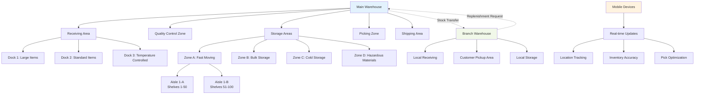
```mermaid
flowchart TD
    A[Main Warehouse] --> B[Receiving Area]
    A --> C[Quality Control Zone]
    A --> D[Storage Areas]
    A --> E[Picking Zone]
    A --> F[Shipping Area]
    
    B --> B1[Dock 1: Large Items]
    B --> B2[Dock 2: Standard Items]
    B --> B3[Dock 3: Temperature Controlled]
    
    D --> D1[Zone A: Fast Moving]
    D --> D2[Zone B: Bulk Storage]
    D --> D3[Zone C: Cold Storage]
    D --> D4[Zone D: Hazardous Materials]
    
    D1 --> D1A[Aisle 1-A<br/>Shelves 1-50]
    D1 --> D1B[Aisle 1-B<br/>Shelves 51-100]
    
    G[Branch Warehouse] --> H[Local Receiving]
    G --> I[Customer Pickup Area]
    G --> J[Local Storage]
    
    A -.->|Stock Transfer| G
    G -.->|Replenishment Request| A
    
    K[Mobile Devices] --> L[Real-time Updates]
    L --> M[Location Tracking]
    L --> N[Inventory Accuracy]
    L --> O[Pick Optimization]
    
    style A fill:#e3f2fd
    style G fill:#f1f8e9
    style K fill:#fff3e0
```

### Stock Movement Tracking

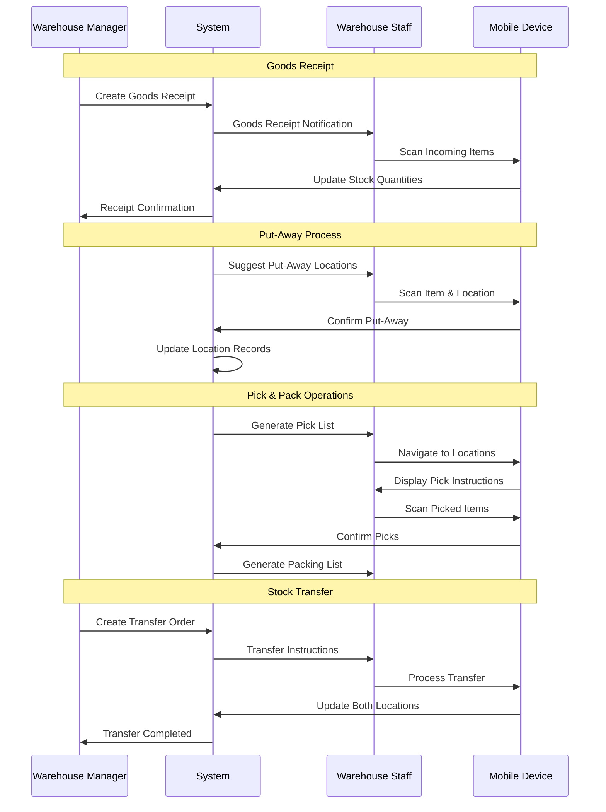
```mermaid
sequenceDiagram
    participant WM as Warehouse Manager
    participant SYS as System
    participant WH as Warehouse Staff
    participant MOB as Mobile Device
    
    Note over WM,MOB: Goods Receipt
    WM->>SYS: Create Goods Receipt
    SYS->>WH: Goods Receipt Notification
    WH->>MOB: Scan Incoming Items
    MOB->>SYS: Update Stock Quantities
    SYS->>WM: Receipt Confirmation
    
    Note over WM,MOB: Put-Away Process
    SYS->>WH: Suggest Put-Away Locations
    WH->>MOB: Scan Item & Location
    MOB->>SYS: Confirm Put-Away
    SYS->>SYS: Update Location Records
    
    Note over WM,MOB: Pick & Pack Operations
    SYS->>WH: Generate Pick List
    WH->>MOB: Navigate to Locations
    MOB->>WH: Display Pick Instructions
    WH->>MOB: Scan Picked Items
    MOB->>SYS: Confirm Picks
    SYS->>WH: Generate Packing List
    
    Note over WM,MOB: Stock Transfer
    WM->>SYS: Create Transfer Order
    SYS->>WH: Transfer Instructions
    WH->>MOB: Process Transfer
    MOB->>SYS: Update Both Locations
    SYS->>WM: Transfer Completed
```

## Financial Management

### Complete Financial Workflow

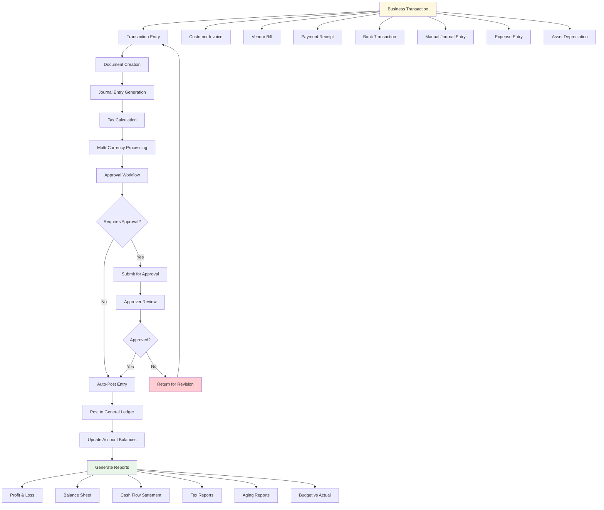
```mermaid
flowchart TD
    A[Business Transaction] --> B[Transaction Entry]
    B --> C[Document Creation]
    C --> D[Journal Entry Generation]
    D --> E[Tax Calculation]
    E --> F[Multi-Currency Processing]
    F --> G[Approval Workflow]
    
    G --> H{Requires Approval?}
    H -->|Yes| I[Submit for Approval]
    H -->|No| J[Auto-Post Entry]
    I --> K[Approver Review]
    K --> L{Approved?}
    L -->|No| M[Return for Revision]
    L -->|Yes| J
    M --> B
    
    J --> N[Post to General Ledger]
    N --> O[Update Account Balances]
    O --> P[Generate Reports]
    
    A --> A1[Customer Invoice]
    A --> A2[Vendor Bill]
    A --> A3[Payment Receipt]
    A --> A4[Bank Transaction]
    A --> A5[Manual Journal Entry]
    A --> A6[Expense Entry]
    A --> A7[Asset Depreciation]
    
    P --> P1[Profit & Loss]
    P --> P2[Balance Sheet]
    P --> P3[Cash Flow Statement]
    P --> P4[Tax Reports]
    P --> P5[Aging Reports]
    P --> P6[Budget vs Actual]
    
    style A fill:#fff8e1
    style P fill:#e8f5e8
    style M fill:#ffcdd2
```

### Invoice and Payment Processing

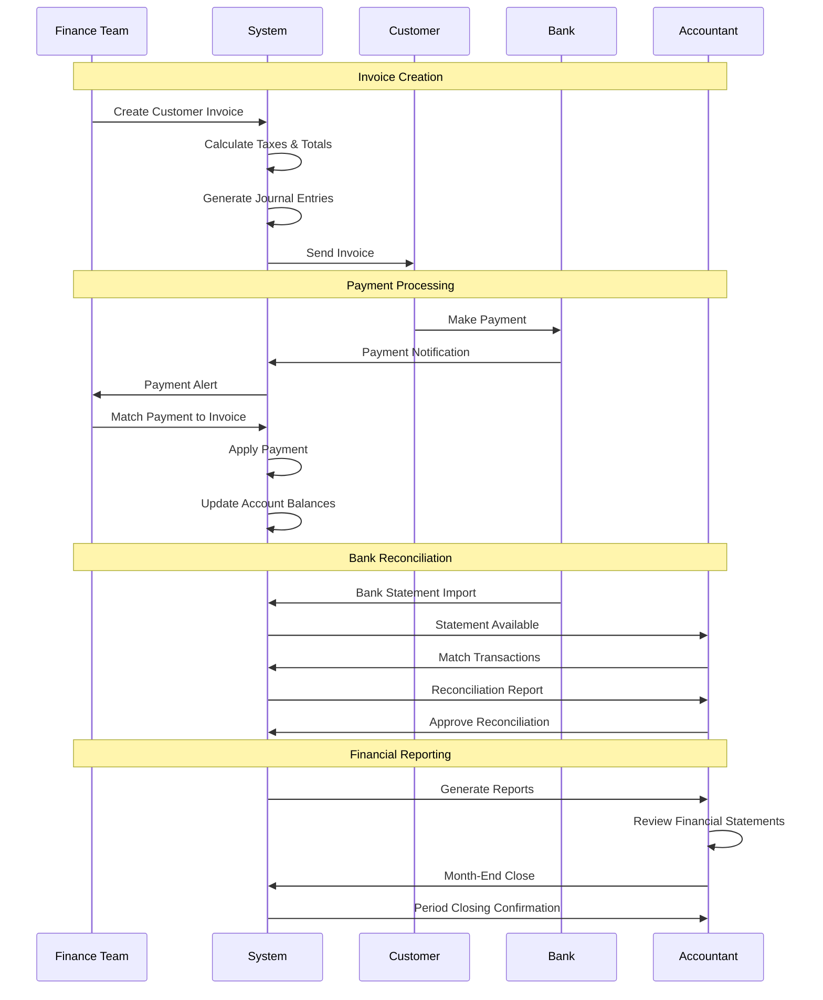
```mermaid
sequenceDiagram
    participant FIN as Finance Team
    participant SYS as System
    participant CUST as Customer
    participant BANK as Bank
    participant ACC as Accountant
    
    Note over FIN,ACC: Invoice Creation
    FIN->>SYS: Create Customer Invoice
    SYS->>SYS: Calculate Taxes & Totals
    SYS->>SYS: Generate Journal Entries
    SYS->>CUST: Send Invoice
    
    Note over FIN,ACC: Payment Processing
    CUST->>BANK: Make Payment
    BANK->>SYS: Payment Notification
    SYS->>FIN: Payment Alert
    FIN->>SYS: Match Payment to Invoice
    SYS->>SYS: Apply Payment
    SYS->>SYS: Update Account Balances
    
    Note over FIN,ACC: Bank Reconciliation
    BANK->>SYS: Bank Statement Import
    SYS->>ACC: Statement Available
    ACC->>SYS: Match Transactions
    SYS->>ACC: Reconciliation Report
    ACC->>SYS: Approve Reconciliation
    
    Note over FIN,ACC: Financial Reporting
    SYS->>ACC: Generate Reports
    ACC->>ACC: Review Financial Statements
    ACC->>SYS: Month-End Close
    SYS->>ACC: Period Closing Confirmation
```

### Multi-Currency Management

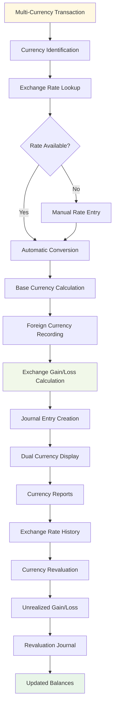
```mermaid
flowchart TD
    A[Multi-Currency Transaction] --> B[Currency Identification]
    B --> C[Exchange Rate Lookup]
    C --> D{Rate Available?}
    D -->|No| E[Manual Rate Entry]
    D -->|Yes| F[Automatic Conversion]
    E --> F
    
    F --> G[Base Currency Calculation]
    G --> H[Foreign Currency Recording]
    H --> I[Exchange Gain/Loss Calculation]
    I --> J[Journal Entry Creation]
    
    J --> K[Dual Currency Display]
    K --> L[Currency Reports]
    L --> M[Exchange Rate History]
    M --> N[Currency Revaluation]
    
    N --> O[Unrealized Gain/Loss]
    O --> P[Revaluation Journal]
    P --> Q[Updated Balances]
    
    style A fill:#fff8e1
    style Q fill:#e8f5e8
    style I fill:#f1f8e9
```

## HR & Employee Management

### Employee Lifecycle Management

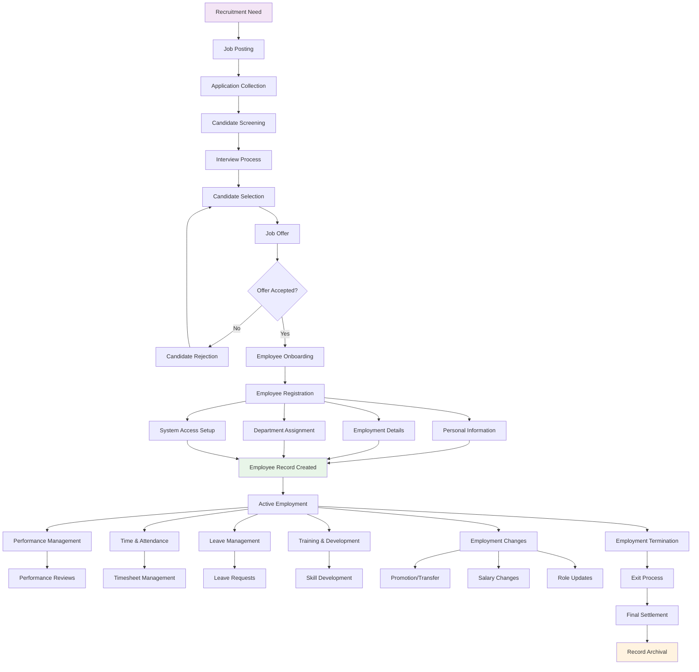
```mermaid
flowchart TD
    A[Recruitment Need] --> B[Job Posting]
    B --> C[Application Collection]
    C --> D[Candidate Screening]
    D --> E[Interview Process]
    E --> F[Candidate Selection]
    F --> G[Job Offer]
    
    G --> H{Offer Accepted?}
    H -->|No| I[Candidate Rejection]
    H -->|Yes| J[Employee Onboarding]
    I --> F
    
    J --> K[Employee Registration]
    K --> L[Personal Information]
    K --> M[Employment Details]
    K --> N[Department Assignment]
    K --> O[System Access Setup]
    
    L --> P[Employee Record Created]
    M --> P
    N --> P
    O --> P
    
    P --> Q[Active Employment]
    Q --> R[Performance Management]
    Q --> S[Time & Attendance]
    Q --> T[Leave Management]
    Q --> U[Training & Development]
    
    R --> V[Performance Reviews]
    S --> W[Timesheet Management]
    T --> X[Leave Requests]
    U --> Y[Skill Development]
    
    Q --> Z[Employment Changes]
    Z --> AA[Promotion/Transfer]
    Z --> BB[Salary Changes]
    Z --> CC[Role Updates]
    
    Q --> DD[Employment Termination]
    DD --> EE[Exit Process]
    EE --> FF[Final Settlement]
    FF --> GG[Record Archival]
    
    style A fill:#f3e5f5
    style P fill:#e8f5e8
    style GG fill:#fff3e0
```

### Time and Attendance Management

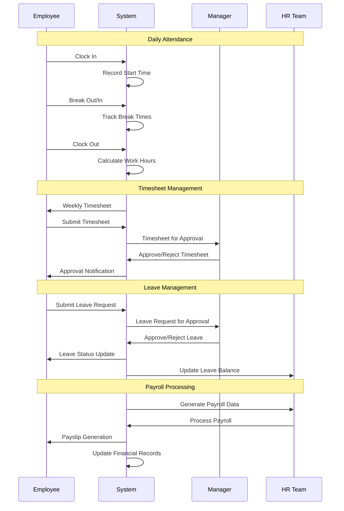
```mermaid
sequenceDiagram
    participant EMP as Employee
    participant SYS as System
    participant MGR as Manager
    participant HR as HR Team
    
    Note over EMP,HR: Daily Attendance
    EMP->>SYS: Clock In
    SYS->>SYS: Record Start Time
    EMP->>SYS: Break Out/In
    SYS->>SYS: Track Break Times
    EMP->>SYS: Clock Out
    SYS->>SYS: Calculate Work Hours
    
    Note over EMP,HR: Timesheet Management
    SYS->>EMP: Weekly Timesheet
    EMP->>SYS: Submit Timesheet
    SYS->>MGR: Timesheet for Approval
    MGR->>SYS: Approve/Reject Timesheet
    SYS->>EMP: Approval Notification
    
    Note over EMP,HR: Leave Management
    EMP->>SYS: Submit Leave Request
    SYS->>MGR: Leave Request for Approval
    MGR->>SYS: Approve/Reject Leave
    SYS->>EMP: Leave Status Update
    SYS->>HR: Update Leave Balance
    
    Note over EMP,HR: Payroll Processing
    SYS->>HR: Generate Payroll Data
    HR->>SYS: Process Payroll
    SYS->>EMP: Payslip Generation
    SYS->>SYS: Update Financial Records
```

### Employee Self-Service Portal

```mermaid
flowchart TD
    A[Employee Login] --> B[Employee Dashboard]
    B --> C[Personal Information]
    B --> D[Time Management]
    B --> E[Leave Management]
    B --> F[Performance]
    B --> G[Documents]
    
    C --> C1[Update Contact Details]
    C --> C2[Emergency Contacts]
    C --> C3[Banking Information]
    
    D --> D1[Clock In/Out]
    D --> D2[View Timesheets]
    D --> D3[Submit Timesheets]
    D --> D4[Overtime Requests]
    
    E --> E1[Request Leave]
    E --> E2[View Leave Balance]
    E --> E3[Leave History]
    E --> E4[Leave Calendar]
    
    F --> F1[Performance Goals]
    F --> F2[Self-Assessment]
    F --> F3[Performance Reviews]
    F --> F4[Training Records]
    
    G --> G1[Employment Documents]
    G --> G2[Payslips]
    G --> G3[Tax Documents]
    G --> G4[Certificates]
    
    style A fill:#f3e5f5
    style B fill:#e8f5e8
    style F1 fill:#f1f8e9
```

## Project Management

### Project Lifecycle Management

```mermaid
flowchart TD
    A[Project Initiation] --> B[Project Planning]
    B --> C[Resource Allocation]
    C --> D[Task Assignment]
    D --> E[Project Execution]
    E --> F[Progress Monitoring]
    F --> G[Project Completion]
    
    A --> A1[Project Proposal]
    A --> A2[Stakeholder Identification]
    A --> A3[Project Approval]
    
    B --> B1[Scope Definition]
    B --> B2[Timeline Creation]
    B --> B3[Budget Planning]
    B --> B4[Risk Assessment]
    
    C --> C1[Team Assignment]
    C --> C2[Equipment Allocation]
    C --> C3[Budget Distribution]
    
    D --> D1[Task Creation]
    D --> D2[Milestone Setting]
    D --> D3[Dependency Mapping]
    
    E --> E1[Task Execution]
    E --> E2[Time Tracking]
    E --> E3[Expense Recording]
    E --> E4[Status Updates]
    
    F --> F1[Progress Reports]
    F --> F2[Budget Monitoring]
    F --> F3[Risk Management]
    F --> F4[Quality Control]
    
    G --> G1[Project Closure]
    G --> G2[Final Billing]
    G --> G3[Resource Release]
    G --> G4[Post-Project Review]
    
    style A fill:#e3f2fd
    style G fill:#e8f5e8
    style F1 fill:#f1f8e9
```

### Task Management and Tracking

```mermaid
sequenceDiagram
    participant PM as Project Manager
    participant SYS as System
    participant TM as Team Member
    participant CLI as Client
    
    Note over PM,CLI: Project Setup
    PM->>SYS: Create Project
    SYS->>PM: Project Created
    PM->>SYS: Add Team Members
    SYS->>TM: Project Assignment Notification
    
    Note over PM,CLI: Task Management
    PM->>SYS: Create Tasks
    SYS->>TM: Task Assignment
    TM->>SYS: Accept Task
    SYS->>PM: Task Accepted
    
    Note over PM,CLI: Progress Tracking
    TM->>SYS: Log Time Spent
    TM->>SYS: Update Task Progress
    TM->>SYS: Add Comments/Notes
    SYS->>PM: Progress Updates
    
    Note over PM,CLI: Client Communication
    PM->>SYS: Generate Progress Report
    SYS->>CLI: Send Report
    CLI->>SYS: Provide Feedback
    SYS->>PM: Client Feedback
    
    Note over PM,CLI: Project Completion
    TM->>SYS: Mark Task Complete
    SYS->>PM: Task Completion Notice
    PM->>SYS: Review & Close Project
    SYS->>CLI: Project Completion Notice
```

### Resource and Budget Management

```mermaid
flowchart TD
    A[Project Budget Creation] --> B[Resource Planning]
    B --> C[Cost Estimation]
    C --> D[Budget Approval]
    D --> E[Resource Allocation]
    
    E --> F[Team Assignment]
    E --> G[Equipment Booking]
    E --> H[Material Requisition]
    
    F --> I[Labor Cost Tracking]
    G --> J[Equipment Cost Tracking]
    H --> K[Material Cost Tracking]
    
    I --> L[Time Logging]
    J --> M[Usage Monitoring]
    K --> N[Expense Recording]
    
    L --> O[Cost Calculation]
    M --> O
    N --> O
    
    O --> P[Budget vs Actual Analysis]
    P --> Q{Budget Variance?}
    Q -->|Over Budget| R[Budget Adjustment Request]
    Q -->|Within Budget| S[Continue Project]
    R --> T[Approval Process]
    T --> U{Approved?}
    U -->|Yes| S
    U -->|No| V[Scope Reduction]
    V --> S
    
    S --> W[Project Billing]
    W --> X[Invoice Generation]
    X --> Y[Payment Processing]
    
    style A fill:#e3f2fd
    style Y fill:#e8f5e8
    style R fill:#fff3e0
```

## Reporting & Analytics

### Business Intelligence Dashboard

```mermaid
flowchart TD
    A[Data Sources] --> B[Data Integration]
    B --> C[Data Processing]
    C --> D[Report Generation]
    D --> E[Dashboard Creation]
    E --> F[User Access]
    
    A --> A1[Sales Data]
    A --> A2[Purchase Data]
    A --> A3[Inventory Data]
    A --> A4[Financial Data]
    A --> A5[HR Data]
    A --> A6[Project Data]
    
    B --> B1[Real-time Sync]
    B --> B2[Data Validation]
    B --> B3[Data Transformation]
    
    C --> C1[KPI Calculation]
    C --> C2[Trend Analysis]
    C --> C3[Comparative Analysis]
    
    D --> D1[Operational Reports]
    D --> D2[Financial Reports]
    D --> D3[Management Reports]
    D --> D4[Compliance Reports]
    
    E --> E1[Executive Dashboard]
    E --> E2[Department Dashboards]
    E --> E3[Personal Dashboards]
    
    F --> F1[Role-Based Access]
    F --> F2[Customizable Views]
    F --> F3[Export Options]
    F --> F4[Scheduled Reports]
    
    style A fill:#fff8e1
    style E fill:#e8f5e8
    style F4 fill:#f1f8e9
```

### Key Performance Indicators (KPIs)

```mermaid
graph TD
    A[Business KPIs] --> B[Sales KPIs]
    A --> C[Financial KPIs]
    A --> D[Operational KPIs]
    A --> E[HR KPIs]
    
    B --> B1[Revenue Growth<br/>Sales Conversion Rate<br/>Customer Acquisition Cost<br/>Customer Lifetime Value]
    
    C --> C1[Gross Margin<br/>Net Profit Margin<br/>Cash Flow<br/>Days Sales Outstanding]
    
    D --> D1[Inventory Turnover<br/>Order Fulfillment Time<br/>Quality Metrics<br/>Supplier Performance]
    
    E --> E1[Employee Satisfaction<br/>Turnover Rate<br/>Training Completion<br/>Productivity Metrics]
    
    B1 --> F[Real-time Monitoring]
    C1 --> F
    D1 --> F
    E1 --> F
    
    F --> G[Automated Alerts]
    F --> H[Trend Analysis]
    F --> I[Benchmarking]
    
    G --> J[Performance Dashboard]
    H --> J
    I --> J
    
    style A fill:#fff8e1
    style J fill:#e8f5e8
```

### Report Management Workflow

```mermaid
sequenceDiagram
    participant U as User
    participant SYS as System
    participant RPT as Report Engine
    participant DB as Database
    
    Note over U,DB: Report Request
    U->>SYS: Request Report
    SYS->>U: Show Report Options
    U->>SYS: Configure Parameters
    SYS->>RPT: Generate Report Request
    
    Note over U,DB: Data Processing
    RPT->>DB: Query Data
    DB->>RPT: Return Dataset
    RPT->>RPT: Process & Format Data
    RPT->>SYS: Report Ready
    
    Note over U,DB: Report Delivery
    SYS->>U: Display Report
    U->>SYS: Export Request
    SYS->>RPT: Generate Export
    RPT->>U: Download File
    
    Note over U,DB: Scheduled Reports
    U->>SYS: Setup Schedule
    SYS->>RPT: Configure Automation
    RPT->>RPT: Auto-Generate Report
    RPT->>U: Email Report
```

---

## Summary

This comprehensive user flow documentation now covers all major business processes in AureusERP:

1. **System Overview**: Role-based dashboard access and business operations
2. **User Authentication & Setup**: Complete user onboarding and role-based permissions
3. **Sales Process**: Comprehensive quote-to-cash workflow with customer management
4. **Purchase Process**: Complete procure-to-pay workflow with vendor management
5. **Inventory Management**: Multi-location warehouse operations and stock control
6. **Financial Management**: Double-entry accounting, invoicing, and payment processing
7. **HR & Employee Management**: Complete employee lifecycle and self-service portal
8. **Project Management**: Project planning, execution, and resource management
9. **Reporting & Analytics**: Business intelligence and performance monitoring

Each section includes detailed mermaid diagrams showing the user journey and business processes from a practical user perspective, focusing on what users see and do in their daily operations with AureusERP.